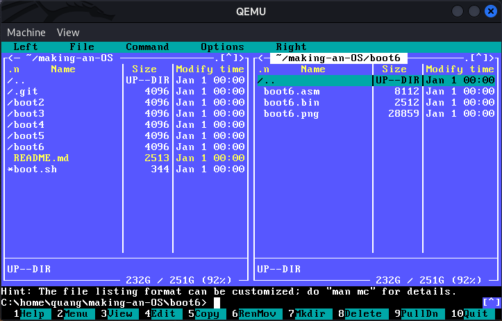

# Making an OS (x86)

This is my code to learn a little bit assembly when I came across the interesting YouTube playlist ["Making an OS (x86)"](https://www.youtube.com/watch?v=MwPjvJ9ulSc&list=PLm3B56ql_akNcvH8vvJRYOc7TbYhRs19M) by [Daedalus Community](https://www.youtube.com/@DaedalusCommunity).
Its aim is to create a 512-byte-long boot sector in `nasm`, an asssembler for the x86 CPU architecture.

## Requirements

Besides `nasm`, the machine emulator `qemu` must also be installed.
I tested my code in [Kali WSL](https://www.kali.org/docs/wsl/wsl-preparations/), so it should work in other Linux distros too.
For Debian-based distro, you can use:

```bash
sudo apt install nasm qemu-system
```

## Structure

The `asm` and `bin` files are located in the directories that correspond to the videos as follows:

| Directory         | Description                                                   | Reference video                                               |
|-------------------|---------------------------------------------------------------|---------------------------------------------------------------|
| [boot2](boot2/)   | Print the alphabet in alternating caps aBcD...                | Chapter 2 - BIOS, Printing the Alphabet, Conditional Jumps    |
| [boot3](boot3/)   | Store and relay keyboard input                                | Chapter 3 - Strings, Keyboard Input in BIOS                   |
| [boot4](boot4/)   | Convert 16-bit `hex` to `dec`                                 | Chapter 4 - Stack, Functions, Segmentation                    |
| [boot5](boot5/)   | Read disk with failure detection                              | Chapter 5 - Reading the disk with BIOS                        |
| [boot6](boot6/)   | Global Descriptor Table and text UI in 32-bit protected mode  | Chapter 6 - Entering Protected mode, GDT                      |



To boot, use the script `boot.sh` with the directory number.
E.g., for `boot2`:

```bash
./boot.sh 2
```

## References

(As recommended by Daedalus Community)

- [NASM cheat sheet](https://www.bencode.net/blob/nasmcheatsheet.pdf)
- [ASCII table](https://www.asciitable.com/)
- [BIOS interrupt 13h](https://en.wikipedia.org/wiki/INT_13H)
- [Text UI](https://wiki.osdev.org/Text_mode)
- [Reference code @mell-o-tron](https://github.com/mell-o-tron/OS-Reference)